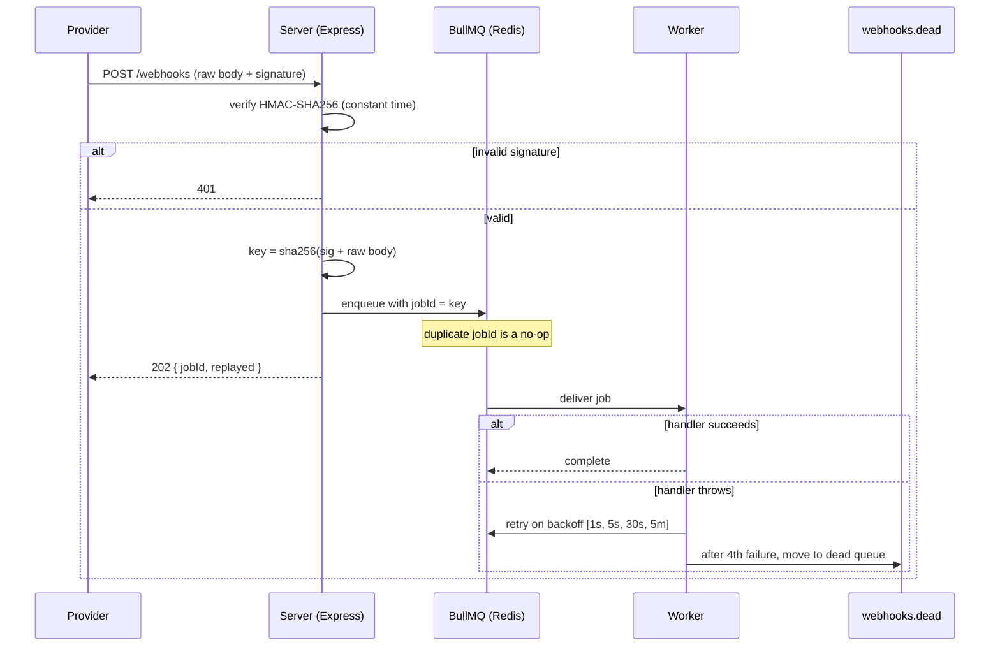

# Architecture

Anvil takes an inbound webhook, checks it is genuine and not a duplicate, hands
it to a background queue, and lets a worker process it with retries. The HTTP
request returns as soon as the job is on the queue, so a slow handler never
makes the sender wait or time out.

The server is the only part that talks to the provider. Its job is small: read
the raw bytes, verify the signature over those exact bytes, compute the
idempotency key, and add one job. Everything slow or failure-prone happens
later, in the worker.

The worker pulls jobs and runs your handler. A thrown error schedules a retry
on a fixed backoff. After the schedule is spent, the job moves to a separate
`webhooks.dead` queue with a `failureContext` recording the attempt count and
the last error message.

Replay is its own process, not part of the worker. The worker never reads the
dead queue, so a handler that always fails cannot loop forever. A person (or a
script they run on purpose) decides when to move a dead job back. See
[IDEMPOTENCY.md](./IDEMPOTENCY.md), [DEAD_LETTER.md](./DEAD_LETTER.md), and
[SECURITY.md](./SECURITY.md) for the details of each step.
